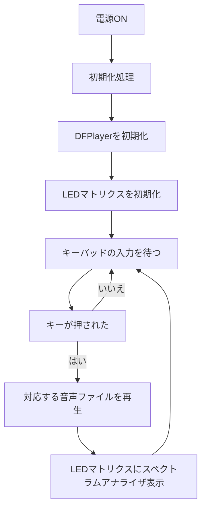

# 卒業制作2025
## 1. 概要 
自作キーパッド + DAW(Logic Pro) + RGB LEDマトリクスを使った自作MPC（Music Production Center）

### *主な機能*

- **キーパッドで音を鳴らす**  
  自作キーパッドを押すと、PCの音楽制作ソフト（Logic Pro）に信号を送り、ドラム音や効果音などのサンプルを再生する

- **Logic Proとの連携による高音質な音声再生**  
  ArduinoからのMIDI信号をLogic Proで受信し、ソフトウェア音源を鳴らす

- **FFT解析（PC側）**  
  Logic Proの音声出力をPCで取得し、リアルタイムFFT解析を実行する

- **WS2812B LEDマトリクスによるビジュアライザー表示**  
  PCで解析した音の強さや周波数に応じて、8×32のLEDマトリクスにスペクトラムアナライザを表示する

- **Arduino Uno R4 WiFiによる統合制御**  
  MIDI信号の送信、LED制御、キーパッド処理を1つのマイコンで実現する

## 2. 仕様書

### *配線図と回路図*
※このプロジェクトではLEDマトリクス（8×32）を使用していますが、Fritzingの都合により配線図では 8×8 のマトリクスで代用しています

### *使用モジュールとピン*

| モジュール名              | 用途                                | 使用ピン（Arduino Uno R4 WiFi）     |
|---------------------------|-------------------------------------|--------------------------------------|
| TM1637キーパッドモジュール | キー入力                         | CLK: D3 / DIO: D4                    |
| WS2812B LEDマトリクス（8×32） | スペクトラムアナライザ表示           | データピン: D6                       |
| Arduino Uno R4 WiFi       | 全体制御（MIDI送信・LED制御・入力処理） | -                                    |
| PC（Logic Pro + FFT解析）            | 音声再生・FFT解析・LED表示データ送信      | USBシリアル通信                      |

## 3. フローチャート

## 参考

- [【Arduino】シリアルLED（WS2812B）を制御する](https://araisun.com/arduino-serial-led.html)
- [ArduinoでAD入力値をFFTしてスペクトル分析＆表示をするチャレンジ](https://qiita.com/moppii/items/e5fb2407f4bae3e95c4a)
- [ErriezTM1637ライブラリ](https://github.com/Erriez/ErriezTM1637)
